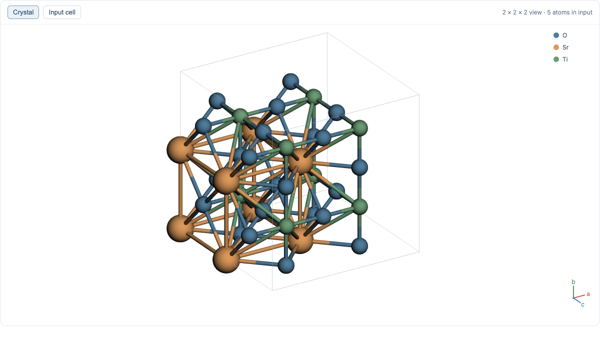
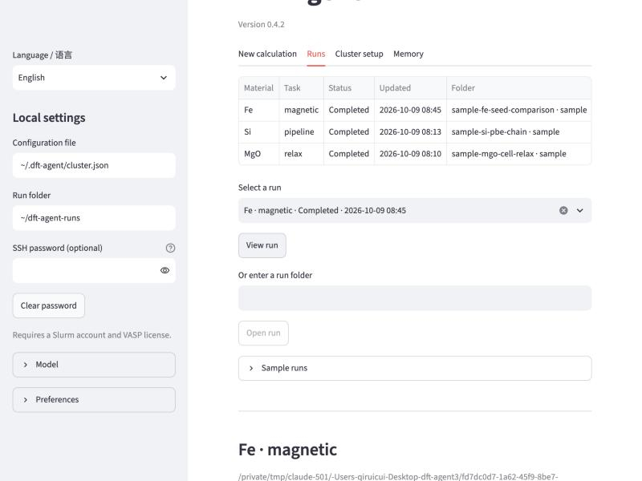
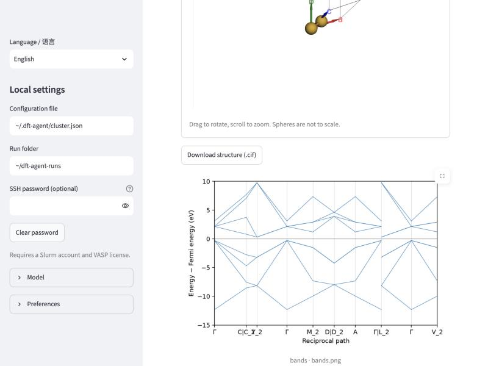
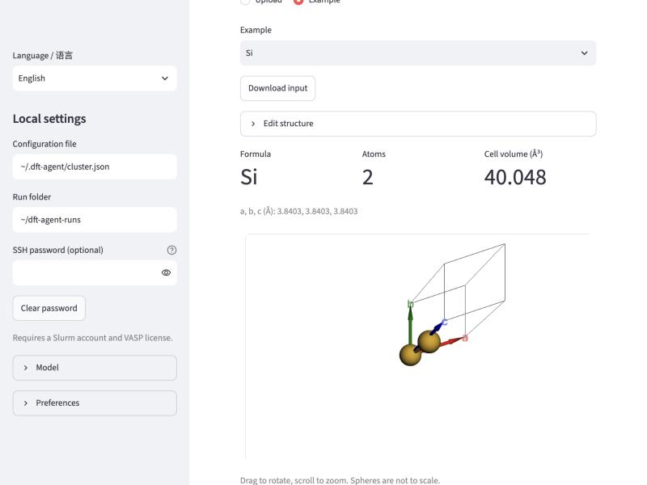
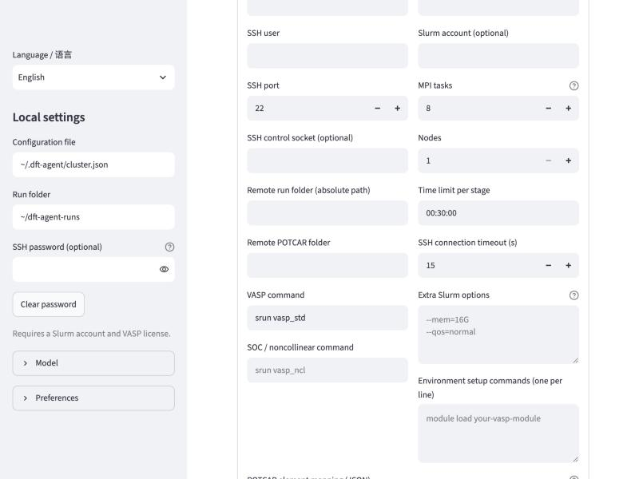

# DFT Agent

Version `0.4.2` — local desktop preview, not yet released. [中文说明](README.zh-CN.md)

[Qirui Cui](https://www.kth.se/profile/qiruic?l=en) · KTH Royal Institute of Technology · [ORCID](https://orcid.org/0009-0005-6165-3237)

DFT Agent prepares and runs first-principles calculations on your HPC cluster from a natural-language goal or manual settings.

Describe a task, review the plan, and run VASP on your Slurm cluster. Combine structure edits, relaxation, SCF, bands and DOS with magnetism, SOC, DFT+U, HSE06 or PBE0. Choose methods by stage and compare magnetic orders, U values or strains.

Desktop packages target Apple Silicon Macs and Windows x64, with Python and the model SDKs included. Windows runs natively; WSL is optional. Linux users can use the Python installation.
Actual calculations require your own Slurm account and licensed VASP/POTCAR files on the cluster. Model features use your own account and billing; no compute time or model credits are included.

## Install and open

Version `0.4.2` is currently a local desktop preview. Once published,
download the installer for your computer from its [GitHub Release](https://github.com/cuiqirui99/dft-agent/releases):

- **Mac, Apple Silicon, macOS 14+:** open the `.dmg`, copy **DFT Agent** to Applications, then open it.
- **Windows x64:** run the `.exe` installer, then open **DFT Agent** from the Start menu.

No separate Python installation is needed. PyPI installation is not yet available
for this preview. See [Install](docs/install.md) for source installation and
[Desktop builds](docs/desktop.md) for the current verification scope.

## Try it without a cluster

- Open **Runs** and click **Load sample runs**. Four real runs are included:
  SrTiO3 and Si workflows, MgO cell relaxation, and Fe NM/FM/AFM comparison.
  Start with SrTiO3: 353 calculated band k-points, projected DOS, plots and raw outputs.
  Results are available offline. **Explain results** requires a model account and network access.
- Open **New calculation**, pick an example structure, choose **Manual**,
  and click **Prepare inputs**. INCAR, KPOINTS and POSCAR are generated locally
  for review; the cluster is attached when you submit.
- Switch the interface to Chinese in the sidebar.

## Connect a model

Open **Model** in the sidebar. Choose your provider:

| Provider | What to enter | Usage |
| --- | --- | --- |
| OpenAI | Your API key and model name; leave API URL blank | Your OpenAI API account |
| Claude, Grok, GLM or DeepSeek | Your provider's API key and model name | Your provider's API account |
| Qwen | Your key, model name and regional API URL | Your Model Studio account |
| Codex CLI | Run `codex login` first; model name can be blank | Your CLI account's plan or API billing |
| Compatible API | Your provider's key, model name and base URL | Your provider's account |

An **API key** gives the app access to your account. **Tokens** measure how much
the model reads and generates. You do not paste tokens into the app.
Consumer chat subscriptions do not automatically include API credits.
Tick **Remember on this computer** to keep a key in the system keychain.
The recorded Claude checks used its SDK with simulated HTTP responses; no live
Claude API call was made. Bundling the SDK does not change that [validation boundary](docs/validation-0.4.1.md).

**[Model setup: get a key, connect and check usage](docs/models.md).**

## Use

1. In **Cluster setup**, enter your SSH host and user, click **Detect from cluster**
   to fill partitions, accounts, VASP modules and POTCAR folders, review and save.
   Presets for Dardel, Tetralith and BSCC give a head start.
2. Open **New calculation**. Upload a CIF or POSCAR, or choose **Example**.
3. Select a provider in **Model**, enter your **Goal**, and click **Plan**. Or use **Manual** without a model.
4. Review the plan and click **Prepare inputs**.
5. Check the inputs, tick the confirmation box and click **Submit calculation**.
6. Follow progress in **Runs**, explain the results, and download the structure.

Include structure changes in your **Goal**, or use **Edit structure** for geometry and file conversion.
[Browse the 18 examples](docs/structures.md).
Structure edits, stage methods, comparisons and follow-up runs are covered in
[Workflows](docs/workflows.md).

Download plots and raw data from **Runs**. **Data and files** also provides
[VASPKIT](docs/vaspkit.md) when it is installed on your cluster.

A desktop notification arrives when a run finishes; add a webhook under
**Preferences** for Slack, Discord or WeChat Work. Reopening the app resumes
monitoring of submitted runs. For `needs_attention`, read the error before using **Reconnect**.

Plans include scientific guidance and relevant past runs. For a failed calculation,
use **Repair** to review a proposed fix and prepare a new run. [Details](docs/harness.md).

**Memory** includes checked guidance and calculation cases. Search their evidence
or import selected local records. Rejected and unverified lessons stay out of
recommendations. [Memory](docs/memory.md).

Supports OpenAI, Claude, Qwen, Grok, GLM, DeepSeek, compatible APIs and a logged-in Codex CLI. Planning shares your goal and structure; explanations share verified results and dialogue. Manual mode needs no model account. Codex CLI is a separate, optional installation.

Model calls use compact context and record reported token counts. [Model use](docs/token-use.md).

Use ordered periodic structures. Check the starting parameters for your material. Magnetic comparisons cover the supplied configurations. Keep the app local.

## Citation

Cui, Q. (2026). *DFT Agent* (v0.4.2, local preview). [Source](https://github.com/cuiqirui99/dft-agent).

[Archived v0.3.0](https://doi.org/10.5281/zenodo.23260917).

[Quickstart](docs/quickstart.md) · [Install](docs/install.md) · [Windows](docs/windows.md) · [Methods](docs/methods.md) · [Input defaults](docs/input-defaults.md) · [CLI examples](docs/examples.md) · [Validation](docs/validation-0.4.1.md) · [MIT license](LICENSE) · [Notices](NOTICE.md) · [Citation](CITATION.cff)
