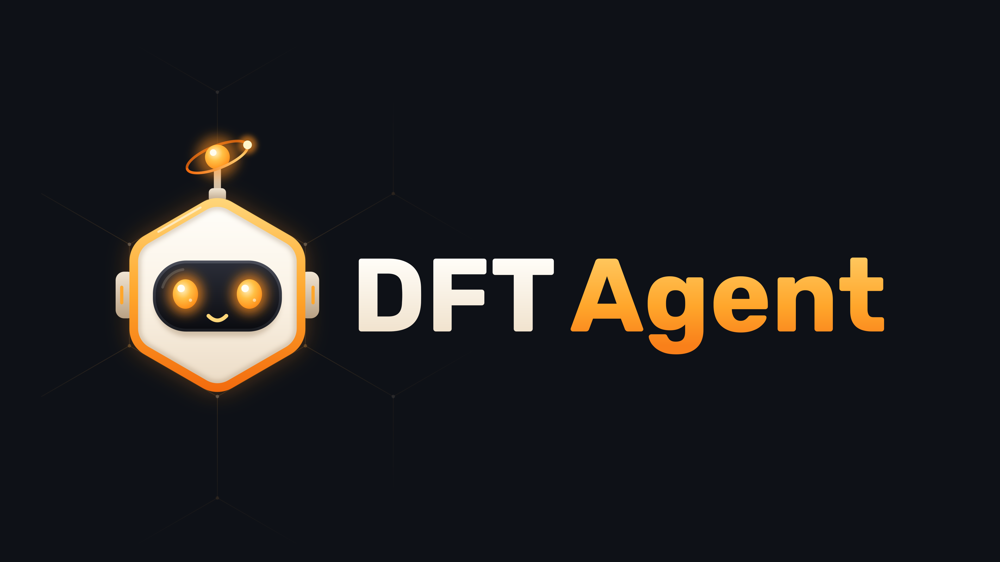

# DFT Agent

版本 `0.4.2`，当前为本地桌面预览，尚未发布。[English](README.md)

[Qirui Cui](https://www.kth.se/profile/qiruic?l=en) · KTH 皇家理工学院 · [ORCID](https://orcid.org/0009-0005-6165-3237)

DFT Agent 根据自然语言目标或手动参数，准备并在你的 HPC 集群上执行第一性原理计算。

描述任务，检查计划，然后在你的 Slurm 集群上运行 VASP。支持结构编辑、弛豫、SCF、能带和态密度，可组合磁性、SOC、DFT+U、HSE06 或 PBE0，按阶段选择方法，并对比磁性构型、U 值或应变。

桌面安装包面向 Apple Silicon Mac 和 Windows x64，内置 Python 和模型 SDK，无需另装 Python。Windows 原生运行，WSL 为可选方案；Linux 可使用 Python 安装方式。
真正执行计算仍需你自己的 Slurm 集群账号，以及集群上已授权的 VASP 和 POTCAR 文件。模型功能使用你自己的账号和账单，DFT Agent 不包含计算时间或模型额度。

## 安装并打开

`0.4.2` 安装包目前仅为本地预览。正式发布后，从对应的 [GitHub Release](https://github.com/cuiqirui99/dft-agent/releases) 下载：

- **Apple Silicon Mac，macOS 14+：**打开 `.dmg`，把 **DFT Agent** 拖入“应用程序”，再打开应用。
- **Windows x64：**运行 `.exe` 安装程序，然后从开始菜单打开 **DFT Agent**。

当前预览尚未在 PyPI 发布。源码安装见[安装指南](docs/install.md)，打包与验收范围见[桌面版说明](docs/desktop.md)。

## 没有集群也能试用

- 在 **Runs（计算记录）** 点击 **Load sample runs（加载示例计算）**，可离线浏览四个真实计算：SrTiO3 和 Si 工作流、MgO 晶胞弛豫、Fe NM/FM/AFM 磁性对比。建议先看 SrTiO3，包含 353 个实际计算的能带 k 点、投影态密度、图表和原始输出。**解释结果**需要连接模型，使用你自己的账号额度。
- 在 **New calculation（新建计算）** 页面选择示例结构和 **Manual（手动）** 模式，点击 **Prepare inputs（准备输入文件）**，不需要集群或模型就能看到生成的 INCAR、KPOINTS 和 POSCAR。提交时再关联集群设置。
- 在侧边栏把语言切换为中文。

## 连接模型

在侧边栏打开 **Model（模型）**，选择服务商：

| 服务商 | 需要填写 | 计费 |
| --- | --- | --- |
| OpenAI | API 密钥和模型名称；API 地址留空 | 你的 OpenAI API 账号 |
| Claude、Grok、GLM 或 DeepSeek | 服务商的 API 密钥和模型名称 | 你的服务商账号 |
| Qwen（通义千问） | 密钥、模型名称和所在地区的百炼 API 地址 | 你的百炼账号 |
| Codex CLI | 先运行 `codex login`；模型名称可留空 | 该 CLI 账号的套餐或 API 计费 |
| 兼容 API | 服务商的密钥、模型名称和基础地址 | 你的服务商账号 |

勾选 **Remember on this computer（在本机记住）** 可以把密钥存入系统钥匙串，下次启动不用再粘贴。详见[模型设置](docs/models.md)。
聊天订阅不自动包含 API 额度，Codex CLI 也需要单独安装并登录。已有 Claude 验证使用真实 SDK 和模拟 HTTP 响应，没有调用真实 Claude API；内置 SDK 不代表已完成实网验证，详见[验证记录](docs/validation-0.4.1.md)。

## 使用

1. 在 **Cluster setup（集群设置）** 中填写 SSH 主机和用户名，点击 **Detect from cluster（从集群探测）** 自动填写分区、账号、VASP 模块和 POTCAR 目录，检查后保存。也可以先从 Dardel、Tetralith 或北京超算等预设开始。
2. 打开 **New calculation**，上传 CIF 或 POSCAR，或选择示例结构。
3. 在 **Model** 中选择服务商，填写 **Goal（目标）**，点击 **Plan（生成计划）**。没有模型账号时可用 **Manual（手动）** 模式。
4. 检查计划，点击 **Prepare inputs**。
5. 检查输入文件，勾选确认框，点击 **Submit calculation（提交计算）**。
6. 在 **Runs** 中跟踪进度，解释结果，下载结构。

结构修改可以直接写在目标里，也可以用 **Edit structure（编辑结构）** 做几何编辑和格式转换。[18 个示例结构](docs/structures.md)。阶段方法、对比和后续计算见[工作流程](docs/workflows.md)。

在图旁下载 CSV，在 **Raw data and files** 中下载 VASP 原始文件。

计算完成时会发送桌面通知，也可以在偏好设置里填写 Webhook 地址（Slack、Discord、企业微信等）。重新打开应用时会自动恢复已提交计算的监控。

失败的计算可以用 **Repair（修复）** 查看修复建议并准备新的运行。[详情](docs/harness.md)。**Memory（记忆）** 包含经过校验的指导和案例。[记忆](docs/memory.md)。

模型调用使用精简的上下文，并记录报告的 token 用量。[模型用量](docs/token-use.md)。

请使用有序的周期性结构，并针对你的材料检查起始参数。请在本机运行本应用。

## 引用

Cui, Q. (2026). *DFT Agent* (v0.4.2，本地预览). [源码](https://github.com/cuiqirui99/dft-agent).

[v0.3.0 存档](https://doi.org/10.5281/zenodo.23260917)。

[快速开始](docs/quickstart.md) · [安装](docs/install.md) · [Windows](docs/windows.md) · [方法](docs/methods.md) · [输入默认值](docs/input-defaults.md) · [命令行示例](docs/examples.md) · [验证](docs/validation-0.4.1.md) · [MIT 许可证](LICENSE) · [声明](NOTICE.md) · [引用](CITATION.cff)
